# The Shadow Speaks Project Vietnam War Draft Lottery Analysis (DRAFT)

March 20, 2025 
Commerce City, Colorado 

My name is Edward Karlo, several years retired from a 50 year career in IT.

I have created a new entry for the NFT market. I believe it is most interesting and significant and have written this ‘Prospectus’ to
describe a complex and abstract story. I call it an A2B-NFT (Art / Asset Backed-NFT) as it is an NFT with historical physical art,
documents and computer hard and soft wares. Perhaps there are already names for such as this.
This is a draft ‘Prospectus’ for eventual minting and marketing of the A2B-NFT.

**"The Shadow Speaks" [1972] Overview** 
In high school (66-68) my favorite classes were science, math and especially radio and electronics. During this time I also attended
the Emily Griffith Opportunity School in Downtown Denver taking courses in electricity, general electronics, computer circuits and
programming fundamentals. This continued after graduation.

In late 1969 a recruiter from a company called “Scientific Software Corporation” (SSC) came calling looking for a computer operator
on their Burroughs B5500 mainframe. A seminal moment in my career and good for the company as well.

[https://en.wikipedia.org/wiki/Emily_Griffith_Technical_College](https://en.wikipedia.org/wiki/Emily_Griffith_Technical_College) 
[https://en.wikipedia.org/wiki/Burroughs_Large_Systems#B5500](https://en.wikipedia.org/wiki/Burroughs_Large_Systems#B5500) 
 
SSC mainly did computer modeling and accounting services for oil companies. Very scientific. Place was loaded with PhDs.
Physicists, math wizards, programmers and I was a lowly computer operator slaving away in the engine room. It was glorious.

A month in, the job is going great and the boss asks my draft status. "1A". The Vietnam war was on and a draft lottery was
instituted for men born 1950-1953 for the 1970-1973 draft. For fairness and order. I was in the 1971 lottery and had a high number
giving me a "1Y" status - draft only if aliens from outer space attack.

In the early 1970s there were reports the 1970 lottery was not random. Draftees in the later months of the year were more likely to
draw a low number. The company had a program called "PrinterMap" or "ShadowMap" that was used to make simple contour maps
of oil fields and wells on the line printer. Each line would be printed eight times and by overprinting could make all sorts of
characters. I thought it would be interesting to input the 1970 lottery numbers into the program to see what it would reveal. The
poor little ALGOL program did its best to make a contour map out of random numbers and went loopy. It revealed nothing but the
resulting, accidental, printout stretching nearly 3 1/2 pages of 14 7/8 x 11” computer paper was so striking I framed it and called it
"The Shadow Speaks". It has been on my office wall at work and home for over 50 years.
 
 
### Historical - "TheShadow Speaks" [1972]
**"The Shadow Speaks" [1972] - E. Karlo - 38” x 16.5”, Burroughs B5500, ALGOL 60** 
Line printer, 3+ pages of pin fed computer paper. 
Printout of alphanumeric characters, 214 lines x 120 columns, rotated 90 degrees counterclockwise. 
Frame is pine molding with black enamel 'piano finish’ symbolic of the black border newspapers put around obituaries. 
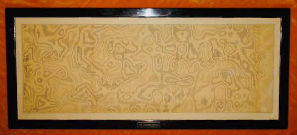 
 
**Close up of lower center engraved title plate** 
Made at an engraving kiosk in the Cinderella City Mall near the fountain. Meant to be similar to observed military uniform name badges. 
[https://en.wikipedia.org/wiki/Cinderella_City](https://en.wikipedia.org/wiki/Cinderella_City) 
Title is a play on the intro to the 1930s radio program “The Shadow”. 
[https://en.wikipedia.org/wiki/The_Shadow](https://en.wikipedia.org/wiki/The_Shadow) 
The introductory line from the radio adaptation of The Shadow – "Who knows what evil lurks in the hearts of men? The Shadow
knows!" – spoken by actor Frank Readick, has earned a place in the American idiom. These words were accompanied by an
ominous laugh and a musical theme, Camille Saint-Saëns' Le Rouet d'Omphale ("Omphale's Spinning Wheel," composed in 1872). 
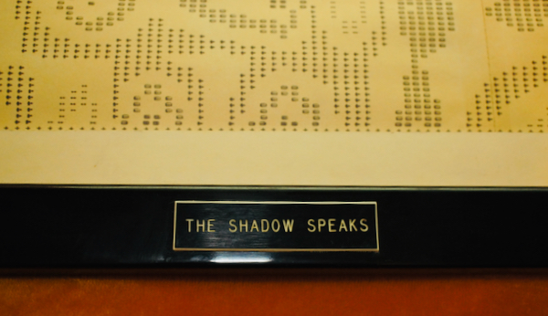 
 
**Back** 
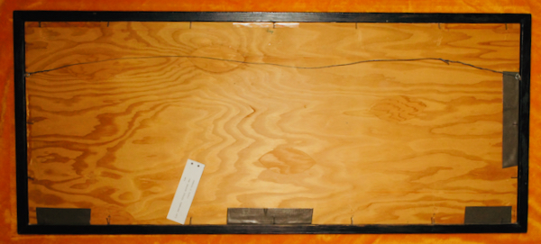 
 
**The Shadow Speaks, program listings in lower center** 
Test runs and fragments lower right dated 2/29/72, 6/13/72, 6/19/72, 6/30/72, 1/16/73. 
Human for scale. 
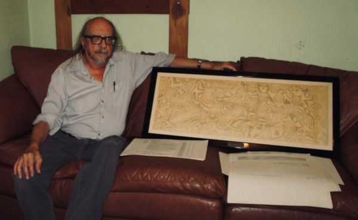 
 
**ALGOL program listings dated 2/29/72 on blank paper (top) and 4/13/71 on standard lined paper** 
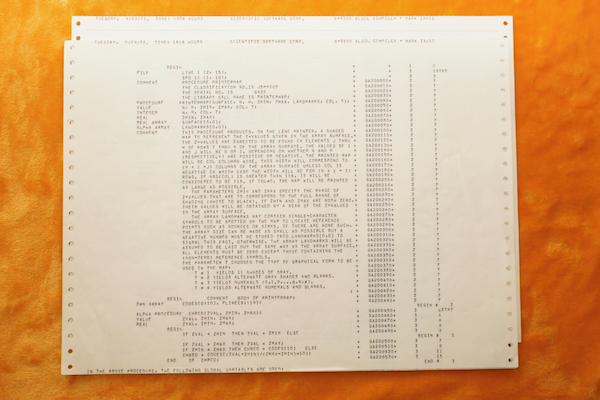 
 
**Photo of pages 9-10 of the Scientific Software Corporation, Second Annual Report, Feb 1, 1970 - Jan 31,1971** 
Leftmost and bottom right pictures show the B5500 operating console “The SPO”. *My station*, where I managed the mainframe.

Top right (left) is William Hinkle founder of Keyvest, with an innovative Trust Accounting System, that I worked for in the late 70s.

Center right are the B5500 tape drives with the line printer in background.

(I was given a few shares of SSC stock due to a wage and price freeze along with Nixon closing of the gold window due to the
costs of the Vietnam war. Sold decades later to finance an Internet adventure for $248.) 
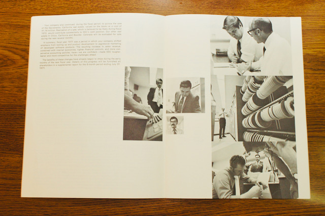 
 
**Closeup** 
Totally posed. Every one of these gentlemen were skilled programmer / analysts and lived in cubicles or offices and I
tended to the machine.

Bottom right picture of the console just showed input commands and MCP (Master Control Program) output
and nobody did that.

Curtained window in back opened into the Conference room. They would open the curtains to show off the
machine to clients. Plus ça change, plus c'est la même chose.

At 20 years old and a bit scruffy I probably was not photogenic
enough for the Annual Report. 
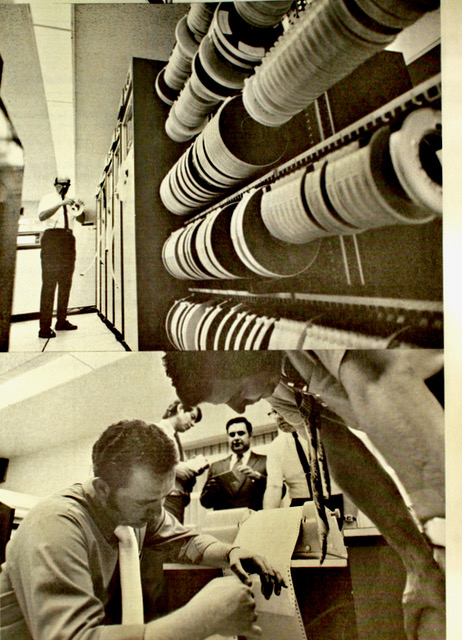 
 
**B5500 Line Printer in back** 
Printer electronics box on right about 4’x3’x3’ (HWD) and the
box on the left similar in size was the printer mechanics. Bottom held a box of pin
fed paper (~1400 pages), above that a spinning character drum, huge ribbon,
tractor feed with multiple adjustment knobs and levers, a special punched paper tape
to control vertical tabbing and 132 separate hammers - one for each column. Top of
printer was a heavily sound padded lid and an illuminated window showing the action.
Paper exited the back to a mechanical stacker. With the lid up it let out an earsplitting banshee scream.

Fellow shown was a very innovative PA that owned a filling station and garage in a former life. 
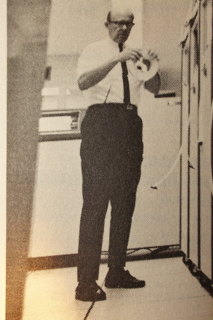 
 
 
### Historical - "Shadow[70..73]" [1990]
**"Shadow70, Shadow71, Shadow72, Shadow73]" [1990] - ACM SIGGRAPH Gallery Showing** 
In May of 1990 the local Denver/Boulder chapter of ACM SIGGRAPH (Association for Computing Machinery - Special Interest
Group on Computer Graphics and Interactive Techniques) held a computer art show in a downtown Denver gallery. I reprised the
1972 work using modern equipment and materials for four years of the draft. (I joined ACM in 1976 and was Chair of the local
Denver Rocky Mountain Chapter of the ACM for three years around this time as well as a member of SIGGRAPH.)
The display consisted of The Shadow Speaks, Shadow[70..73] and a descriptive placard.

Announcement of Second Annual Computer Graphics Art Show. First annual announcement on right. 
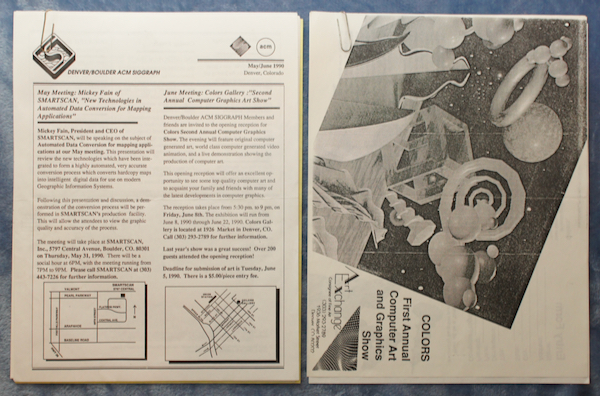 
 
**Shadow70 and documentation booklet** 
 
 
**Shadow[70..73] and Associated booklets** 
Shadow70 - The Shadow Speaks 
Shadow71 - Black and Blue and Gray 
Shadow72 - Fire and Blood 
Shadow73 - The Fog of War 

Amiga 1000+TurboAmi (68020, 2 mb ram, hard drive) 
C code 
Epson JX-80 color matrix pin printer used for Shadow71 and Shadow72
Brother Twinriter 5 hybrid b&w daisy wheel / matrix pin printer used for Shadow70 and Shadow73 in daisy wheel mode.

*The Fog of War: Eleven Lessons from the Life of Robert S. McNamara* 
[https://en.wikipedia.org/wiki/The_Fog_of_War](https://en.wikipedia.org/wiki/The_Fog_of_War) 
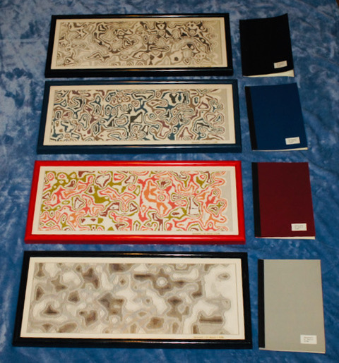 
 
**Backs showing gallery entry applications with small gallery labels in white** 
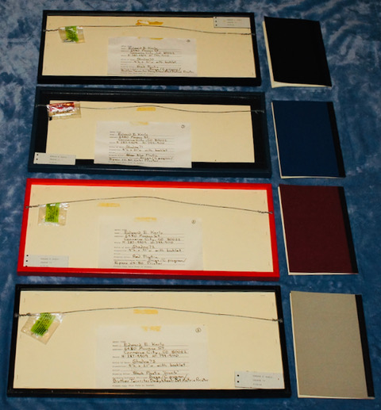 
 
**Closeups of title text in lower right corner** 
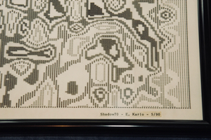 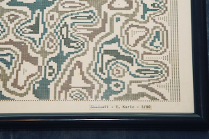 
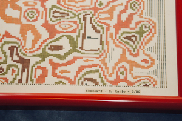 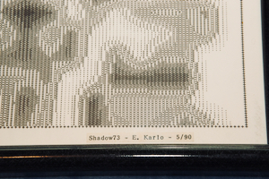 
 
**Shadow71 - my draft year. I am about 2/3 down and 1/3 from left - August 12, 1951 #320** 
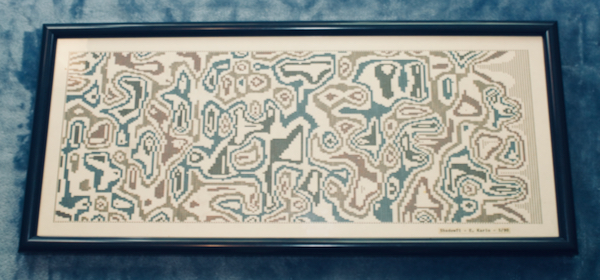 
 
**Placard from gallery showing (19” x 10”). Similar to booklet contents** 
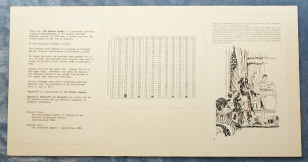 
 
**Test runs and experiments** 
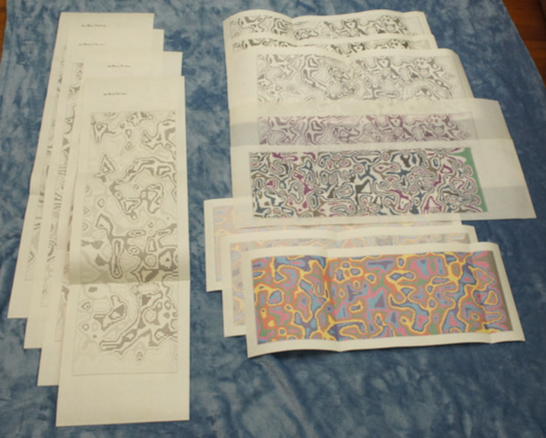 

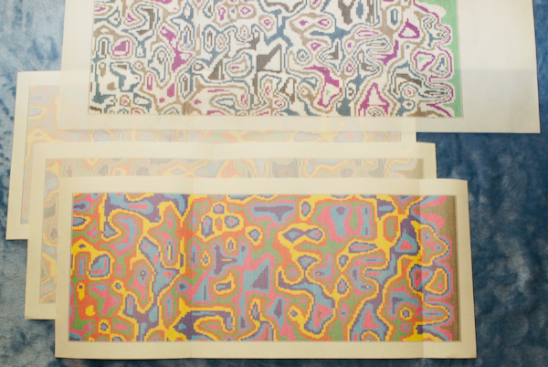 
 
**Various folders - notes and documents** 
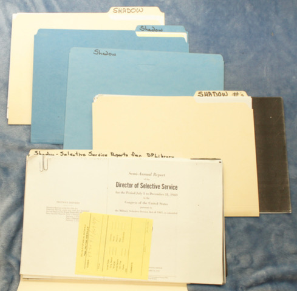 
 
**The most excellent Amiga 1000 and two unidentified observers - 1985 product launch** 
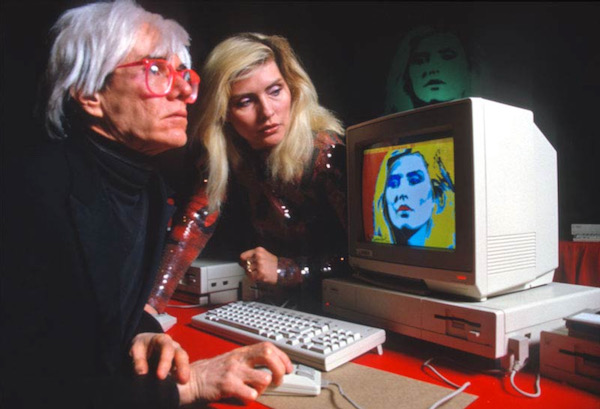 
 
**The magnificent Epson JX-80 dot matrix printer. CMYK ribbon and manuals** 
Used for Shadow71 and Shadow72. 
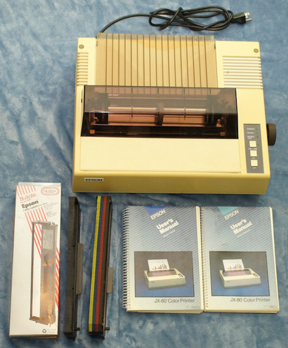 
 
**The magnificent Brother Twinriter 5 Daisy Wheel / Dot Matrix printer** 
Box is 29” x 21” for size reference. Heavy. 
Used for Shadow70 and Shadow73 in daisy wheel mode. 
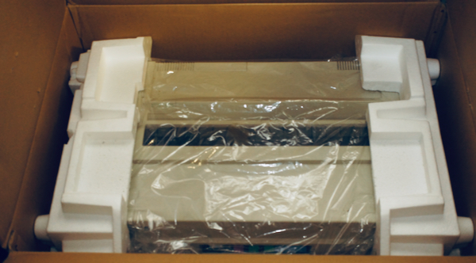 
 
**Twinriter Tractor Feeder accessary in box** 
Manual (9” x 12” for size reference). Stack of used ribbons. 
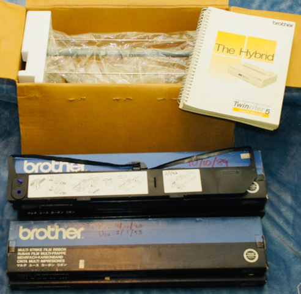 
 
**Daisy Wheels** 
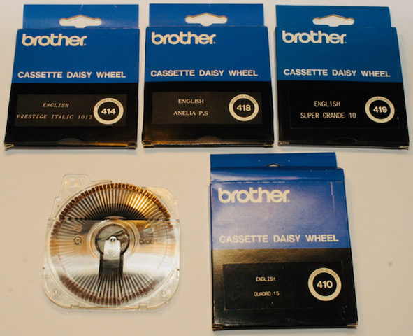 
 
**Daisy Wheel closeup** 
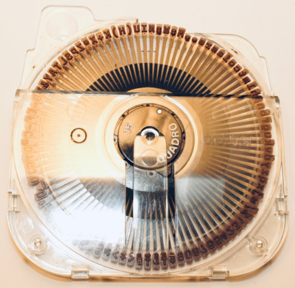 
 
**Software and files where archived on Amiga format floppy disks** 
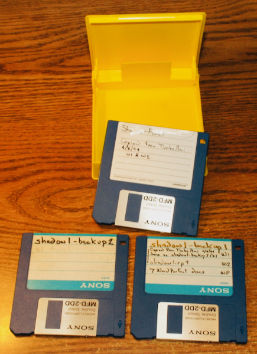 
 
 
### Current NFT - "Vietnam War Draft Lottery 2022" [2025]
**"Vietnam War Draft Lottery 2022" [2025]** 
In October 2022 I suddenly decided to recreate the 1990 displays in the form af an NFT PNG image.

The first step was the recovery of the code and files from the Amiga format floppies which presented a problem. Amiga floppies
cannot be read on a PC due to controller limitations. Resurrecting a 30 yo old Amiga, monitor, external floppy drive and software
that was possible but was loath to risk the old disks on old equipment. A number of solutions are available and settled on the Great
Greaseweazle Floppy adapter.

**Greaseweazle purchase from eBay** 
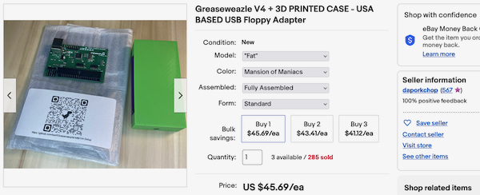 
 
**Apparatus used for floppy recovery** 
*Greaseweazle* in green 3D printed case - floppy drive to USB interface. 
Floppy cable in back and USB cable on right front to PC and special software. 
Power supply for floppy drive power. 
Floppy drive, 1 of 2 purchased as being “New in original shrink wrapped box”. 
Recovery process worked without a hitch. 
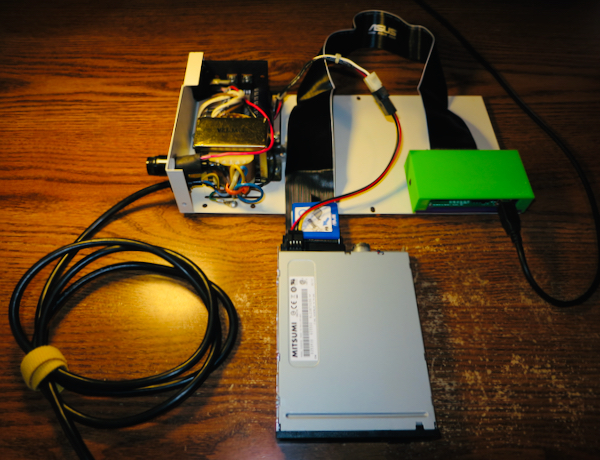 
 
 
**ToDo**
 
 
**MatrixPrinter output image from test module ShadowNFTTrustButVerify.java** 
Shows implementation of all matrix characters and various applied font effects. 
Letter Quality uses system font rather than built in matrix font. 
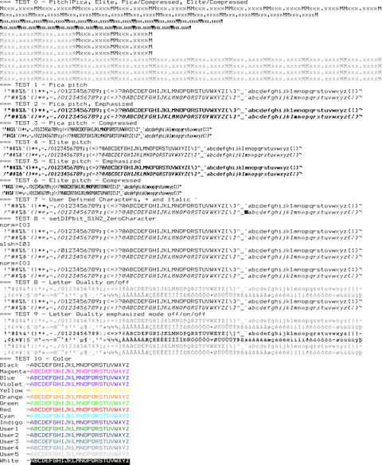 
 
**TheSpadowSpeaks2022NFT.png NFT image** 
Photo of computer monitor showing TheSpadowSpeaks2022NFT.png in dark room using Windows Photo Viewer. 
Note blue power led in lower right for scale. Algorithm was changed because of issues converting from an analog printer CMYK to digital RGB (hard). 
Note that the display of Shadow70 (top) was changed to show the higher numbers as dark areas (safe) to light areas (subject to draft). 
The area in the lower right appears to show less dark areas supporting the claim that the later months were non random due to improperly mixed capsules. 
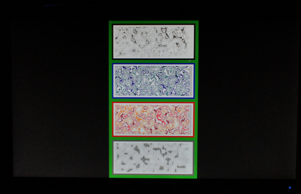 
 
**Photo of computer monitor showing TheSpadowSpeaks2022NFT.png in low light using Windows Photo Viewer.** 
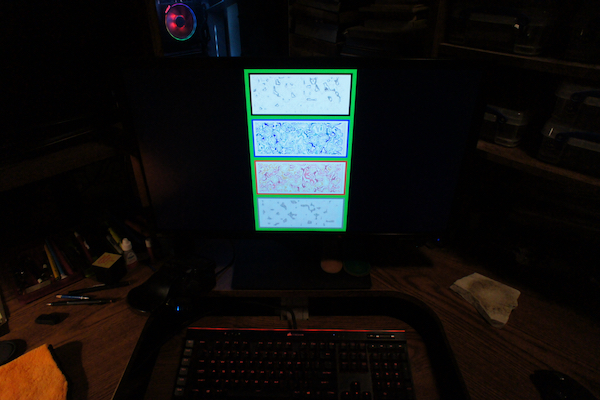 
 
**Photo of computer monitor showing Eclipse IDE with TheShadowSpeaks2022NFT.java in left editor pane and shadow1.c in right pane** 
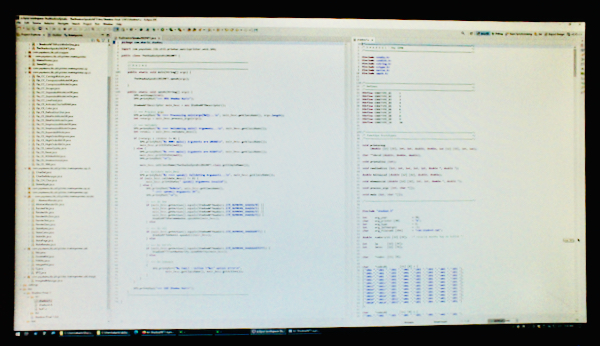 
 
**Photo of computer monitor showing Eclipse IDE superimposed with TheShadowSpeaks2022NFT.png using the Mozilla browser** 
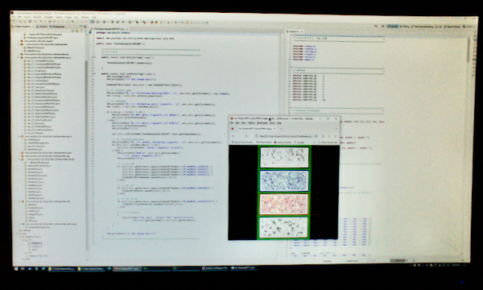 
 
**Shadow70 (top) with TheShadowSpeaks2022NFT.png printed on 13” x 19” and 8.5” x 11 paper** 
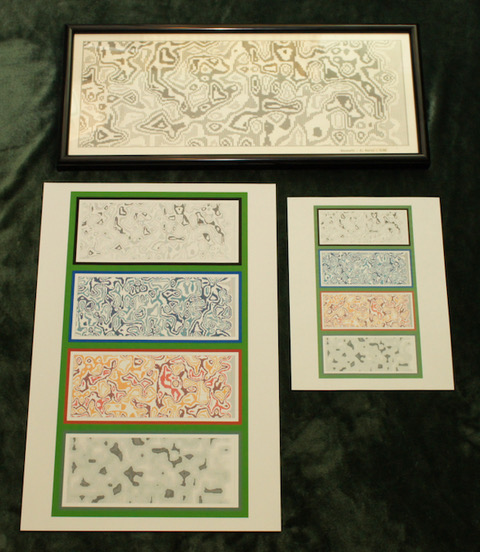 
 
**Summary** 
Strange, surreal, abstract, exotic, Dada-esque even but with an underlying heart of cold technocratic knife edged madness and
macabre horror. 
Significant and interesting because … 
- Historical and rare generative art from 50+ years ago and 30+ years ago.
- Historical reference to past major events - the Vietnam war and the draft lottery.
- Current chatter about current wars (Ukraine et al) and need for resumption of draft.
- MatrixPrinter code might be a good open source project or associated / included with the NFT in some way. Retro rules!
Offering includes: 
 
 
**ToDo**
 
 

Edward E Karlo 
ekarlo@ysystems.com 
303-287-6147 
======= End of Document =======
