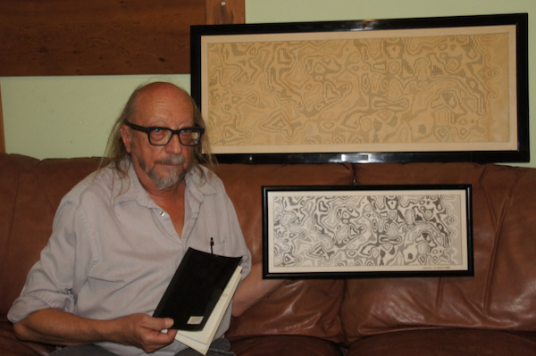

# The Shadow Speaks Project<br>Vietnam War Draft Lottery Analysis (DRAFT)

March 20, 2025<br>
Commerce City, Colorado<br>

My name is Edward Karlo, several years retired from a 50 year career in IT.

I have created a new entry for the NFT market. I believe it is most interesting and significant and have written this ‘Prospectus’ to
describe a complex and abstract story. I call it an A2B-NFT (Art / Asset Backed-NFT) as it is an NFT with historical physical art,
documents and computer hard and soft wares. Perhaps there are already names for such as this.
This is a draft ‘Prospectus’ for eventual minting and marketing of the A2B-NFT.

**"The Shadow Speaks" [1972] Overview**<br>
In high school (66-68) my favorite classes were science, math and especially radio and electronics. During this time I also attended
the Emily Griffith Opportunity School in Downtown Denver taking courses in electricity, general electronics, computer circuits and
programming fundamentals. This continued after graduation.

In late 1969 a recruiter from a company called “Scientific Software Corporation” (SSC) came calling looking for a computer operator
on their Burroughs B5500 mainframe. A seminal moment in my career and good for the company as well.

[https://en.wikipedia.org/wiki/Emily_Griffith_Technical_College](https://en.wikipedia.org/wiki/Emily_Griffith_Technical_College)<br>
[https://en.wikipedia.org/wiki/Burroughs_Large_Systems#B5500](https://en.wikipedia.org/wiki/Burroughs_Large_Systems#B5500)<br>
<br>
SSC mainly did computer modeling and accounting services for oil companies. Very scientific. Place was loaded with PhDs.
Physicists, math wizards, programmers and I was a lowly computer operator slaving away in the engine room. It was glorious.

A month in, the job is going great and the boss asks my draft status. "1A". The Vietnam war was on and a draft lottery was
instituted for men born 1950-1953 for the 1970-1973 draft. For fairness and order. I was in the 1971 lottery and had a high number
giving me a "1Y" status - draft only if aliens from outer space attack.

In the early 1970s there were reports the 1970 lottery was not random. Draftees in the later months of the year were more likely to
draw a low number. The company had a program called "PrinterMap" or "ShadowMap" that was used to make simple contour maps
of oil fields and wells on the line printer. Each line would be printed eight times and by overprinting could make all sorts of
characters. I thought it would be interesting to input the 1970 lottery numbers into the program to see what it would reveal. The
poor little ALGOL program did its best to make a contour map out of random numbers and went loopy. It revealed nothing but the
resulting, accidental, printout stretching nearly 3 1/2 pages of 14 7/8 x 11” computer paper was so striking I framed it and called it
"The Shadow Speaks". It has been on my office wall at work and home for over 50 years.
<br>
<br>
### Historical - "TheShadow Speaks" [1972]
**"The Shadow Speaks" [1972] - E. Karlo - 38” x 16.5”, Burroughs B5500, ALGOL 60**<br>
Line printer, 3+ pages of pin fed computer paper.<br>
Printout of alphanumeric characters, 214 lines x 120 columns, rotated 90 degrees counterclockwise.<br>
Frame is pine molding with black enamel 'piano finish’ symbolic of the black border newspapers put around obituaries.<br>
<br>
<br>
**Close up of lower center engraved title plate**<br>
Made at an engraving kiosk in the Cinderella City Mall near the fountain. Meant to be similar to observed military uniform name badges.<br>
[https://en.wikipedia.org/wiki/Cinderella_City](https://en.wikipedia.org/wiki/Cinderella_City)<br>
Title is a play on the intro to the 1930s radio program “The Shadow”.<br>
[https://en.wikipedia.org/wiki/The_Shadow](https://en.wikipedia.org/wiki/The_Shadow)<br>
The introductory line from the radio adaptation of The Shadow – "Who knows what evil lurks in the hearts of men? The Shadow
knows!" – spoken by actor Frank Readick, has earned a place in the American idiom. These words were accompanied by an
ominous laugh and a musical theme, Camille Saint-Saëns' Le Rouet d'Omphale ("Omphale's Spinning Wheel," composed in 1872).<br>
<br>
<br>
**Back**<br>
<br>
<br>
**The Shadow Speaks, program listings in lower center**<br>
Test runs and fragments lower right dated 2/29/72, 6/13/72, 6/19/72, 6/30/72, 1/16/73.<br>
Human for scale.<br>
<br>
<br>
**ALGOL program listings dated 2/29/72 on blank paper (top) and 4/13/71 on standard lined paper**<br>
<br>
<br>
**Photo of pages 9-10 of the Scientific Software Corporation, Second Annual Report, Feb 1, 1970 - Jan 31,1971**<br>
Leftmost and bottom right pictures show the B5500 operating console “The SPO”. *My station*, where I managed the mainframe.

Top right (left) is William Hinkle founder of Keyvest, with an innovative Trust Accounting System, that I worked for in the late 70s.

Center right are the B5500 tape drives with the line printer in background.

(I was given a few shares of SSC stock due to a wage and price freeze along with Nixon closing of the gold window due to the
costs of the Vietnam war. Sold decades later to finance an Internet adventure for $248.)<br>
<br>
<br>
**Closeup**<br>
Totally posed. Every one of these gentlemen were skilled programmer / analysts and lived in cubicles or offices and I
tended to the machine.

Bottom right picture of the console just showed input commands and MCP (Master Control Program) output
and nobody did that.

Curtained window in back opened into the Conference room. They would open the curtains to show off the
machine to clients. Plus ça change, plus c'est la même chose.

At 20 years old and a bit scruffy I probably was not photogenic
enough for the Annual Report.<br>
<br>
<br>
**B5500 Line Printer in back**<br>
Printer electronics box on right about 4’x3’x3’ (HWD) and the
box on the left similar in size was the printer mechanics. Bottom held a box of pin
fed paper (~1400 pages), above that a spinning character drum, huge ribbon,
tractor feed with multiple adjustment knobs and levers, a special punched paper tape
to control vertical tabbing and 132 separate hammers - one for each column. Top of
printer was a heavily sound padded lid and an illuminated window showing the action.
Paper exited the back to a mechanical stacker. With the lid up it let out an earsplitting banshee scream.

Fellow shown was a very innovative PA that owned a filling station and garage in a former life.<br>
<br>
<br>
<br>
### Historical - "Shadow[70..73]" [1990]
**"Shadow70, Shadow71, Shadow72, Shadow73]" [1990] - ACM SIGGRAPH Gallery Showing**<br>
In May of 1990 the local Denver/Boulder chapter of ACM SIGGRAPH (Association for Computing Machinery - Special Interest
Group on Computer Graphics and Interactive Techniques) held a computer art show in a downtown Denver gallery. I reprised the
1972 work using modern equipment and materials for four years of the draft. (I joined ACM in 1976 and was Chair of the local
Denver Rocky Mountain Chapter of the ACM for three years around this time as well as a member of SIGGRAPH.)
The display consisted of The Shadow Speaks, Shadow[70..73] and a descriptive placard.

Announcement of Second Annual Computer Graphics Art Show. First annual announcement on right.<br>
<br>
<br>
**Shadow70 and documentation booklet**<br>
<br>
<br>
**Shadow[70..73] and Associated booklets**<br>
Shadow70 - The Shadow Speaks<br>
Shadow71 - Black and Blue and Gray<br>
Shadow72 - Fire and Blood<br>
Shadow73 - The Fog of War<br>

Amiga 1000+TurboAmi (68020, 2 mb ram, hard drive)<br>
C code<br>
Epson JX-80 color matrix pin printer used for Shadow71 and Shadow72
Brother Twinriter 5 hybrid b&w daisy wheel / matrix pin printer used for Shadow70 and Shadow73 in daisy wheel mode.

*The Fog of War: Eleven Lessons from the Life of Robert S. McNamara*<br>
[https://en.wikipedia.org/wiki/The_Fog_of_War](https://en.wikipedia.org/wiki/The_Fog_of_War)<br>
<br>
<br>
**Backs showing gallery entry applications with small gallery labels in white**<br>
<br>
<br>
**Closeups of title text in lower right corner**<br>
 <br>
 <br>
<br>
**Shadow71 - my draft year. I am about 2/3 down and 1/3 from left - August 12, 1951 #320**<br>
<br>
<br>
**Placard from gallery showing (19” x 10”). Similar to booklet contents**<br>
<br>
<br>
**Test runs and experiments**<br>
<br>

<br>
<br>
**Various folders - notes and documents**<br>
<br>
<br>
**The most excellent Amiga 1000 and two unidentified observers - 1985 product launch**<br>
<br>
<br>
**The magnificent Epson JX-80 dot matrix printer. CMYK ribbon and manuals**<br>
Used for Shadow71 and Shadow72.<br>
<br>
<br>
**The magnificent Brother Twinriter 5 Daisy Wheel / Dot Matrix printer**<br>
Box is 29” x 21” for size reference. Heavy.<br>
Used for Shadow70 and Shadow73 in daisy wheel mode.<br>
<br>
<br>
**Twinriter Tractor Feeder accessary in box**<br>
Manual (9” x 12” for size reference). Stack of used ribbons.<br>
<br>
<br>
**Daisy Wheels**<br>
<br>
<br>
**Daisy Wheel closeup**<br>
<br>
<br>
**Software and files where archived on Amiga format floppy disks**<br>
<br>
<br>
<br>
### Current NFT - "Vietnam War Draft Lottery 2022" [2025]
**"Vietnam War Draft Lottery 2022" [2025]**<br>
In October 2022 I suddenly decided to recreate the 1990 displays in the form af an NFT PNG image.

The first step was the recovery of the code and files from the Amiga format floppies which presented a problem. Amiga floppies
cannot be read on a PC due to controller limitations. Resurrecting a 30 yo old Amiga, monitor, external floppy drive and software
that was possible but was loath to risk the old disks on old equipment. A number of solutions are available and settled on the Great
Greaseweazle Floppy adapter.

**Greaseweazle purchase from eBay**<br>
<br>
<br>
**Apparatus used for floppy recovery**<br>
*Greaseweazle* in green 3D printed case - floppy drive to USB interface.<br>
Floppy cable in back and USB cable on right front to PC and special software.<br>
Power supply for floppy drive power.<br>
Floppy drive, 1 of 2 purchased as being “New in original shrink wrapped box”.<br>
Recovery process worked without a hitch.<br>
<br>

**Recovered floppy contents**<br>
shadow.c and shadown.h - program code and lottery numbers<br>
shadow1.rpt - Shadow72 printer codes<br>
*.doc - WordPerfect for Amiga document files for booklets and placard

```
shadow1-backup1           VOLUME  --------  06.04.1994 01:50:37.48
  W1                         DIR  ----rwed  03.06.1990 04:58:00.44
    shadow1                46232  ----rwed  03.06.1990 04:58:11.31
    shadow1.c              23858  ----rwed  03.06.1990 04:55:59.39
    shadow1.lmk              257  ----rwed  24.05.1990 21:49:10.43
    shadow1.lnk               92  ----rwed  29.05.1990 20:07:53.34
    shadow1.o              33540  ----rwed  03.06.1990 04:57:48.44
    shadown.h               7119  ----rwed  29.05.1990 22:57:32.41
    test1                  11224  ----rwed  28.05.1990 11:35:19.44
    test1.c                 2094  ----rwed  28.05.1990 11:34:32.10
    test1.lmk                235  ----rwed  23.05.1990 23:33:59.47
    test1.lnk                 75  ----rwed  23.05.1990 23:34:46.24
    test1.o                 1760  ----rwed  28.05.1990 11:35:04.42
  W2                         DIR  ----rwed  03.06.1990 05:30:33.40
    shadow1.rpt           352165  ----rwed  03.06.1990 05:07:11.25
  WP                         DIR  ----rwed  06.04.1994 01:51:10.06
    Shadow1.doc             1257  ---arwed  03.06.1990 23:19:09.18
    Shadow70.doc            1304  ---arwed  04.06.1990 00:46:01.38
    Shadow71.doc            1285  ---arwed  04.06.1990 01:03:52.00
    Shadow72.doc            1286  ---arwed  04.06.1990 01:21:34.17
    Shadow73.doc            1314  ---arwed  04.06.1990 01:24:24.23
    shadowlabels             336  ---arwed  30.05.1990 03:44:51.23
    shadowlabels.doc         369  ---arwed  04.06.1990 02:25:58.41
sum:          1037  518Ki        530944
data:         1003  501Ki        513536  96.72%
fs:             34   17Ki         17408   3.28%
```

**Development of Java Application**<br>
Once the old C code was recovered I could begin development of a Java application using the Eclipse IDE (Integrated Development Environment).<br>

Eclipse project name: TheShadowSpeaksNFT.<br>

I had the Shadow70 image roughly displayed on the monitor within a week using a simple line-by-line conversion of the shadow1.c code to Java using package com/ysystems/lib/util/mapper.<br>

I then wrote package com/ysystems/lib/util/printer/matrixprinter to simulate the Epson JX-80 and Brother Twinriter 5 printers and process the printer command codes as emitted by the C code, and beyond.<br>

Then package com/ekarlo/shadow was developed the create the “TheShadowSpeaks2022NFT” seen below.<br>

Pure Java (no 3rd party code) Eclipse IDE based project able to write a PNG file with rotation and scale as well as adding custom metadata to the image.<br>
<br>

**Structure of the Eclipse IDE Java project**

```
> tree TheShadowSpeaksNFT
TheShadowSpeaksNFT/
├── .classpath
├── .gitignore
├── .project
├── .settings
│   ├── org.eclipse.core.resources.prefs
│   └── org.eclipse.jdt.core.prefs
├── doc
│   ├── Shadow-Final-1
│   │   ├── Shadow-Final-1.list
│   │   ├── W1
│   │   │   ├── shadow1.c
│   │   │   ├── shadown.h
│   │   │   └── test1.c
│   │   └── W2
│   │       └── shadow1.rpt
│   ├── launch.conf.d
│   │   ├── Imaginal.prototype
│   │   ├── Imaginal_extract-image-metadata_tEXtEntry.launch
│   │   ├── Imaginal_extract-image-metadata_tIME.launch
│   │   ├── Imaginal_extract-image-metadata_zTXtEntry.launch
│   │   ├── Imaginal_list-image-metadata.launch
│   │   ├── MartixPrinter.prototype
│   │   ├── MatrixPrinterTest_test-all.launch
│   │   ├── TheShadowSpeaks2022NFT_Shadow70.launch
│   │   ├── TheShadowSpeaks2022NFT_Shadow71.launch
│   │   ├── TheShadowSpeaks2022NFT_Shadow72.launch
│   │   ├── TheShadowSpeaks2022NFT_Shadow73.launch
│   │   ├── TheShadowSpeaks2022NFT_ShadowBadArgs.launch
│   │   ├── TheShadowSpeaks2022NFT_ShadowNFT.launch
│   │   └── TheShadowSpeaksNFT.prototype
│   └── test
└── src/ ...

8 directories, 24 files
```
<br>

**Structure of the source directory src/**

```
> tree TheShadowSpeaksNFT/src
TheShadowSpeaksNFT/src
└── com
    ├── ekarlo
    │   └── shadow
    │       ├── ShadowNFTDescriptor.java                          Run time structure
    │       ├── ShadowNFTNumbers.java                             Draft lottery numbers for 1970-1973
    │       ├── ShadowNFTSpeaker.java                             Runs ShadowMap
    │       ├── ShadowNFTTrustButVerify.java                      Testing module
    │       ├── ShadowNFTWeGoAll.java                             Generates multi-year PNG NFT
    │       ├── ShadowNFTWhereWeGoOne.java                        Generates single year text for physical printers
    │       └── TheShadowSpeaks2022NFT.java                       Main entry point
    └── ysystems
        └── lib
            ├── image
            │   ├── ImaginalDescriptor.java
            │   ├── ImaginalManager.java                          PNG writer / reader
            │   └── ImaginalRun.java
            ├── mapper
            │   ├── ShadowMap.java                                PrinterMap implementation in Java
            │   └── ShadowMapCodes.java                           PrinterMap display type codes
            ├── printer
            │   └── matrixprinter
            │       ├── MatrixPrinter.java                        Matrix Printer Simulator
            │       ├── MatrixPrinterDescriptor.java
            │       ├── StateDIPs.java                            DIP switches
            │       ├── op
            │       │   ├── Op.java
            │       │   ├── OpDescriptor.java
            │       │   ├── cc                                    Implement Printer Control Codes
            │       │   │   ├── Op_CC_CarriageReturn.java
            │       │   │   ├── Op_CC_CompressedModeOff.java
            │       │   │   ├── Op_CC_CompressedModeOn.java
            │       │   │   ├── Op_CC_Escape.java
            │       │   │   ├── Op_CC_ExpandedModeLinOff.java
            │       │   │   ├── Op_CC_ExpandedModeLinOn.java
            │       │   │   ├── Op_CC_LineFeed.java
            │       │   │   ├── Op_CE_ActivateCharSetRAM.java
            │       │   │   ├── Op_CE_Color.java
            │       │   │   ├── Op_CE_DefineUserChar.java
            │       │   │   ├── Op_CE_ElitePitchModeOff.java
            │       │   │   ├── Op_CE_ElitePitchModeOn.java
            │       │   │   ├── Op_CE_EmphasizedModeOff.java
            │       │   │   ├── Op_CE_EmphasizedModeOn.java
            │       │   │   ├── Op_CE_ExpandedMode.java
            │       │   │   ├── Op_CE_HighOrderBitIgnore.java
            │       │   │   ├── Op_CE_HighOrderBitOff.java
            │       │   │   ├── Op_CE_HighOrderBitOn.java
            │       │   │   ├── Op_CE_LetterQuality.java
            │       │   │   ├── Op_CE_ROMtoRAM.java
            │       │   │   ├── Op_CE_Reset.java
            │       │   │   ├── Op_CE_Unidirectional.java
            │       │   │   └── Op_CE_VMI.java
            │       │   ├── ch                                   Implement Characters
            │       │   │   ├── CharDef.java
            │       │   │   ├── CharDefManager.java
            │       │   │   ├── Op_CH_Char.java
            │       │   │   └── StateGlyph.java
            │       │   └── ex
            │       │       └── Op_EX_Unknown.java
            │       ├── ops                                      Command Code Parser and Executor
            │       │   ├── OpSyllable.java
            │       │   ├── OpSyllableList.java
            │       │   ├── OpVector.java
            │       │   └── OpVectorManager.java
            │       ├── render                                   Renderers
            │       │   ├── AbstractRender.java
            │       │   ├── AbstractRenderGfx.java
            │       │   ├── RenderFile.java
            │       │   ├── RenderGfx.java
            │       │   ├── RenderGfxZero.java
            │       │   ├── RenderTest.java
            │       │   ├── RenderZero.java
            │       │   ├── StateBytes.java
            │       │   ├── StateColor.java
            │       │   ├── StateGfx.java
            │       │   ├── StatePage.java
            │       │   └── StateRender.java
            │       └── test
            │           ├── MPTestGroupA.java
            │           └── MatrixPrinterTest.java
            └── util                                             General Purpose Utilities
                ├── AbstractArgumentDescriptor.java
                ├── Bitz.java
                ├── DoubleRW.java
                ├── FUtility.java
                ├── IntegerRW.java
                ├── Q.java                                       Byte queue and streame
                ├── SPO.java                                     Console run time output
                └── Zipper.java

17 directories, 70 files

Word count: 13,051 lines, 37,814 words, 413,056 characters
```

**Custom metadata added to PNG image**
The PNG image file format is described in the Wikipedia article [https://en.wikipedia.org/wiki/PNG](https://en.wikipedia.org/wiki/PNG)<br>

The image consists of various “chunks” of metadata (image characteristics) and image data.<br>

**"Ancillary chunks" section from Wikipedia article**

Other image attributes that can be stored in PNG files include gamma values, background color, and textual metadatainformation. PNG also supports color management through the inclusion of ICC color profiles.\{21\]<br>
- bKGD gives the default background color. It is intended for use when there is no better choice available, such as in standalone image viewers (but not web browsers; see below for more details).<br>
- cHRM gives the chromaticity coordinates of the display primaries and white point.<br>
- dSIG is for storing digital signatures.\{22\]<br>
- eXIf stores Exif metadata.\{23\]<br>
- gAMA specifies gamma. The gAMA chunk contains only 4 bytes, and its value represents the gamma value multiplied by 100,000; for example, the gamma value 1/3.4 calculates to 29411.7647059 ((1/3.4)*(100,000)) and is converted to an integer (29412) for storage.\{24\]<br>
- hIST can store the histogram, or total amount of each color in the image.<br>
- iCCP is an ICC color profile.<br>
- iTXt contains a keyword and UTF-8 text, with encodings for possible compression and translations marked with language tag. The Extensible Metadata Platform (XMP) uses this chunk with a keyword 'XML:com.adobe.xmp'<br>
- pHYs holds the intended pixel size (or pixel aspect ratio); the pHYs contains "Pixels per unit, X axis" (4 bytes), "Pixels per unit, Y axis" (4 bytes), and "Unit specifier" (1 byte) for a total of 9 bytes.\{25\]<br>
- sBIT (significant bits) indicates the color-accuracy of the source data; this chunk contains a total of between 1 and 5 bytes, depending on the color type.\[26\]\[27\]\[28\]<br>
- sPLT suggests a palette to use if the full range of colors is unavailable.<br>
- sRGB indicates that the standard sRGB color space is used; the sRGB chunk contains only 1 byte, which is used for "rendering intent" (4 values—0, 1, 2, and 3—are defined for rendering intent).\{29\]<br>
- sTER stereo-image indicator chunk for stereoscopic images.\{30\]<br>
- tEXt can store text that can be represented in ISO/IEC 8859-1, with one key-value pair for each chunk. The "key" must be between one and 79 characters long. Separator is a null character. The "value" can be any length, including zero up to the maximum permissible chunk size minus the length of the keyword and separator. Neither "key" nor "value" can contain null character. Leading or trailing spaces are also disallowed.<br>
- tIME stores the time that the image was last changed.<br>
- tRNS contains transparency information. For indexed images, it stores alpha channel values for one or more palette entries. For truecolor and grayscale images, it stores a single pixel value that is to be regarded as fully transparent.<br>
- zTXt contains compressed text (and a compression method marker) with the same limits as tEXt.<br>

The lowercase first letter in these chunks indicates that they are not needed for the PNG specification. The lowercase last letter in some chunks indicates that they are safe to copy, even if the application concerned does not understand them.<br>

By default the image contains an IHDR chunk sufficient to display the image.<br>

Additional metadata chunks that might be useful in an NFT image are:<br>
dSIG - not implemented<br>
iTXt - not implemented<br>
tEXt - two sample key-value pairs created<br>
tIME - sample created with current UTC time<br>
zTXt - key-value pair created with entire zipped Eclipse project<br>

*Note: The zTXt chunk is a novel feature in that the NFT image contains the code needed to create the image and extract the metadata.*


**MatrixPrinter output image from test module ShadowNFTTrustButVerify.java**<br>
Shows implementation of all matrix characters and various applied font effects.<br>
Letter Quality uses system font rather than built in matrix font.<br>
<br>
<br>
**TheSpadowSpeaks2022NFT.png NFT image**<br>
Photo of computer monitor showing TheSpadowSpeaks2022NFT.png in dark room using Windows Photo Viewer.<br>
Note blue power led in lower right for scale. Algorithm was changed because of issues converting from an analog printer CMYK to digital RGB (hard).<br>
Note that the display of Shadow70 (top) was changed to show the higher numbers as dark areas (safe) to light areas (subject to draft).<br>
The area in the lower right appears to show less dark areas supporting the claim that the later months were non random due to improperly mixed capsules.<br>
<br>
<br>
**Photo of computer monitor showing TheSpadowSpeaks2022NFT.png in low light using Windows Photo Viewer**<br>
<br>
<br>
**Photo of computer monitor showing Eclipse IDE with TheShadowSpeaks2022NFT.java in left editor pane and shadow1.c in right pane**<br>
<br>
<br>
**Photo of computer monitor showing Eclipse IDE superimposed with TheShadowSpeaks2022NFT.png using the Mozilla browser**<br>
<br>
<br>
**Shadow70 (top) with TheShadowSpeaks2022NFT.png printed on 13” x 19” and 8.5” x 11 paper**<br>
<br>
<br>
**Summary**<br>
Strange, surreal, abstract, exotic, Dada-esque even but with an underlying heart of cold technocratic knife edged madness and
macabre horror.<br>
Significant and interesting because …<br>
- Historical and rare generative art from 50+ years ago and 30+ years ago.
- Historical reference to past major events - the Vietnam war and the draft lottery.
- Current chatter about current wars (Ukraine et al) and need for resumption of draft.
- MatrixPrinter code might be a good open source project or associated / included with the NFT in some way. Retro rules!
Offering includes:<br>
<br>
**ToDo**
<br>
<br>

Edward E Karlo<br>
ekarlo@ysystems.com<br>
303-287-6147<br>
======= End of Document =======
